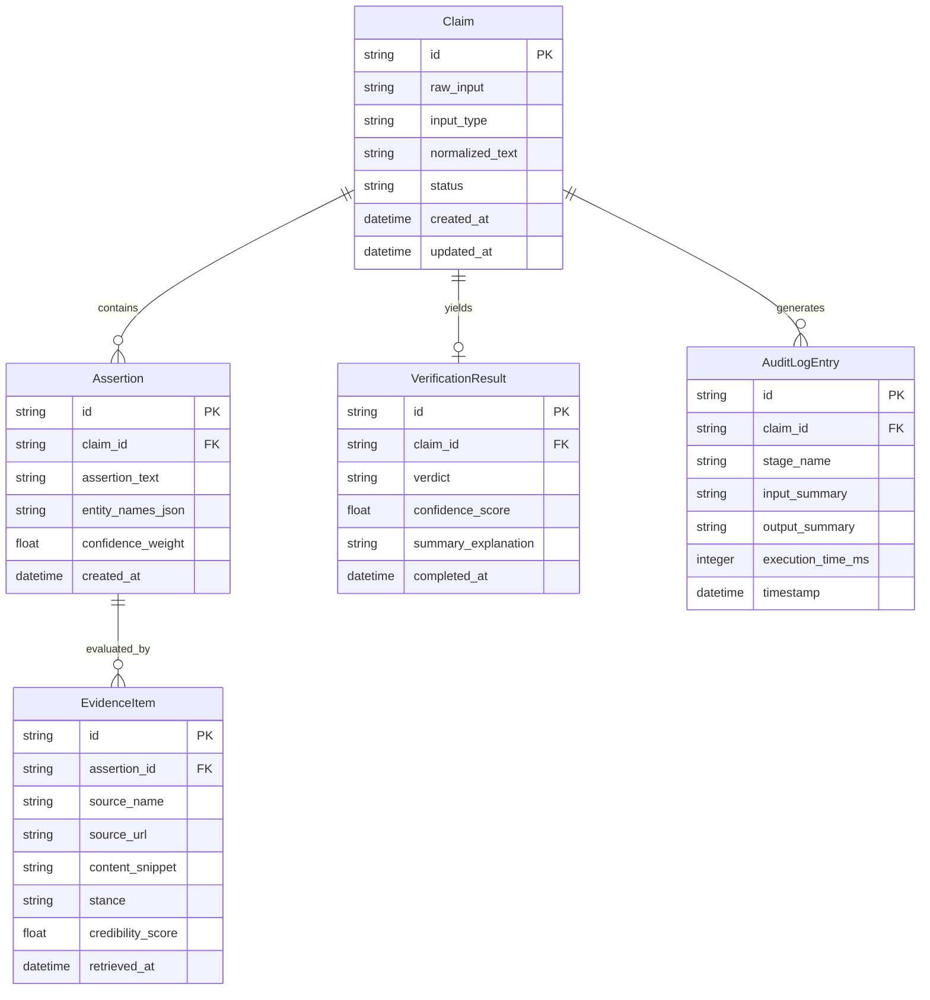

# Data Model Specification: DeepVerify Narrative Verification Engine

## Entity Definitions & Relationships



## Detailed Field Specs & Constraints

### 1. `Claim`
- **`id`**: String (UUIDv4), Primary Key.
- **`raw_input`**: Text, NOT NULL. Original raw text, URL, or media metadata submitted by user.
- **`input_type`**: Enum (`text`, `url`, `media`), NOT NULL.
- **`normalized_text`**: Text, NULLABLE until normalized. Cleaned, standard-format representation of the claim.
- **`status`**: Enum (`submitted`, `extracted`, `verifying`, `completed`, `failed`), Default: `submitted`.
- **`created_at`**: Datetime (UTC), Default: `CURRENT_TIMESTAMP`.
- **`updated_at`**: Datetime (UTC), Updated on modification.

### 2. `Assertion`
- **`id`**: String (UUIDv4), Primary Key.
- **`claim_id`**: String (UUIDv4), Foreign Key -> `Claim.id` (ON DELETE CASCADE), NOT NULL.
- **`assertion_text`**: Text, NOT NULL. Atomic, testable factual sub-claim.
- **`entity_names_json`**: Text (JSON string), Array of extracted entity strings (e.g. `["Organization X", "Person Y"]`).
- **`confidence_weight`**: Float (0.0 to 1.0), Default: `1.0`. Weight of assertion in overall verdict calculation.
- **`created_at`**: Datetime (UTC).

### 3. `EvidenceItem`
- **`id`**: String (UUIDv4), Primary Key.
- **`assertion_id`**: String (UUIDv4), Foreign Key -> `Assertion.id` (ON DELETE CASCADE), NOT NULL.
- **`source_name`**: String (255), NOT NULL. Publisher or domain name (e.g., "Reuters", "FactCheck.org").
- **`source_url`**: String (2048), NULLABLE. Direct link to evidence article/document.
- **`content_snippet`**: Text, NOT NULL. Extract or excerpt supporting/refuting the assertion.
- **`stance`**: Enum (`supports`, `refutes`, `neutral`), NOT NULL.
- **`credibility_score`**: Float (0.0 to 1.0), NOT NULL. Assessed domain/source trust index.
- **`retrieved_at`**: Datetime (UTC).

### 4. `VerificationResult`
- **`id`**: String (UUIDv4), Primary Key.
- **`claim_id`**: String (UUIDv4), Foreign Key -> `Claim.id` (ON DELETE CASCADE), Unique, NOT NULL.
- **`verdict`**: Enum (`Verified`, `Uncertain`, `Unsupported`, `Contested`), NOT NULL.
- **`confidence_score`**: Float (0.0 to 100.0), NOT NULL. Aggregated confidence percentage.
- **`summary_explanation`**: Text, NOT NULL. Human-readable summary of verdict justification.
- **`completed_at`**: Datetime (UTC).

### 5. `AuditLogEntry`
- **`id`**: String (UUIDv4), Primary Key.
- **`claim_id`**: String (UUIDv4), Foreign Key -> `Claim.id` (ON DELETE CASCADE), NOT NULL.
- **`stage_name`**: String (100), NOT NULL (e.g., `NORMALIZATION`, `ENTITY_EXTRACTION`, `EVIDENCE_RETRIEVAL`, `STANCE_EVALUATION`, `VERDICT_AGGREGATION`).
- **`input_summary`**: Text, NOT NULL. Brief description of stage input parameters.
- **`output_summary`**: Text, NOT NULL. Brief description of stage outcome/metrics.
- **`execution_time_ms`**: Integer, NOT NULL. Duration in milliseconds.
- **`timestamp`**: Datetime (UTC).

## State Transitions (Claim Lifecycle)

```
[SUBMITTED] ──> [EXTRACTED] ──> [VERIFYING] ──> [COMPLETED]
     │               │               │
     └───(Error)─────┴───(Error)─────┴───> [FAILED]
```
